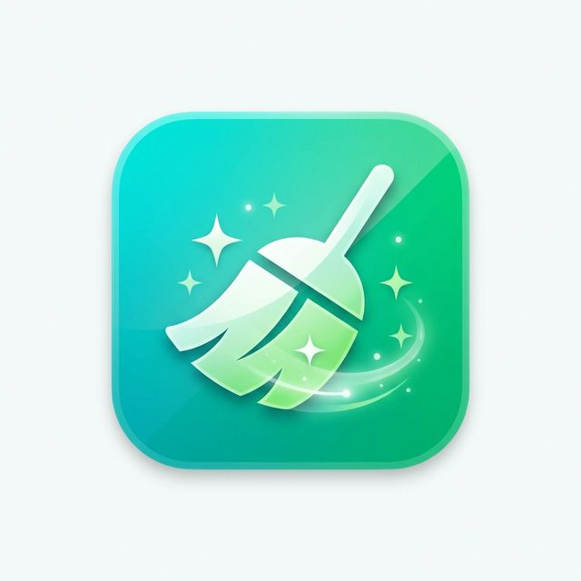

# 🧹 CleanMac

**The free, open-source macOS cleaner that respects your privacy.**



## 📥 Download & Install

**[Download Latest Version (ZIP)](https://github.com/Haadesx/CleanMac/releases/latest)**

1. **Download** the `CleanMac.zip` from the link above.
2. **Unzip** definition to get `CleanMac.app`.
3. **Drag** `CleanMac.app` to your **Applications** folder.
4. **Right-click** (Control+Click) the app and select **Open**.
5. Click **Open** in the dialog box (this is required only once).

> **Note:** Since this is a free open-source app and not notarized by Apple, you might see a warning saying *"Apple could not verify CleanMac is free of malware"*. This is normal for apps not distributed via the App Store. **Right-clicking and choosing Open** is the safe way to bypass this.

---

## ✨ Features

### 🚀 **Instant Optimization**
- **System Junk**: Remove gigabytes of cache, logs, and temporary files safely.
- **Smart Clean**: One-click analysis to free up space instantly.

### 📱 **App Manager**
- **Uninstaller**: Completely remove apps *and* their hidden leftover files (containers, preferences, caches).
- **App Discovery**: Find every app installed on your system.

### 🛡️ **Privacy & Security**
- **Malware Scanner**: Detect and remove threats, adware, and potentially unwanted programs.
- **Local Processing**: All scanning happens on your Mac. No data is ever sent to the cloud.

### 📊 **Visual Storage**
- **Space Lens**: Visualize your disk usage with an interactive sunburst chart to find what's taking up space.
- **Performance Monitor**: Real-time stats for CPU, Memory, Battery, and Network.

### Requirements
- Xcode 15.0+
- Swift 5.9+
- macOS 14.0+ SDK

## 🏛️ Architecture

- **SwiftUI** for modern, declarative UI
- **@Observable** for reactive state management
- **Swift Concurrency** with strict actor isolation
- **Privileged Helper Tool** for secure root operations
- **Split Process Model** for security

## 📁 Project Structure

```
CleanMac/
├── CleanMacApp.swift           # App entry point
├── ContentView.swift           # Main navigation
├── Services/
│   ├── DiskAnalyzer.swift      # Junk file scanning
│   ├── AppManager.swift        # App discovery & uninstall
│   ├── SystemMonitor.swift     # Performance monitoring
│   ├── SpaceLensScanner.swift  # Disk visualization
│   ├── MalwareScanner.swift    # Threat detection
│   └── SafetyDatabase.swift    # Protected paths
├── Views/
│   ├── Dashboard/              # Overview & quick actions
│   ├── SystemJunk/             # Junk cleaning UI
│   ├── Uninstaller/            # App removal UI
│   ├── SpaceLens/              # Sunburst chart
│   ├── Performance/            # System stats
│   └── Privacy/                # Malware scanning
└── Models/
    └── AppInfo.swift           # Data models
```

## 📜 License

MIT License - See [LICENSE](LICENSE) for details.

## 🤝 Contributing

Contributions are welcome! Please read our contributing guidelines before submitting a PR.

1. Fork the repository
2. Create your feature branch (`git checkout -b feature/amazing-feature`)
3. Commit your changes (`git commit -m 'Add amazing feature'`)
4. Push to the branch (`git push origin feature/amazing-feature`)
5. Open a Pull Request

## 🙏 Acknowledgments

- Built following [Apple Human Interface Guidelines](https://developer.apple.com/design/human-interface-guidelines/)
- Inspired by CleanMyMac and other macOS utilities
- Uses SF Symbols for iconography

---

**Made with ❤️ for macOS**
